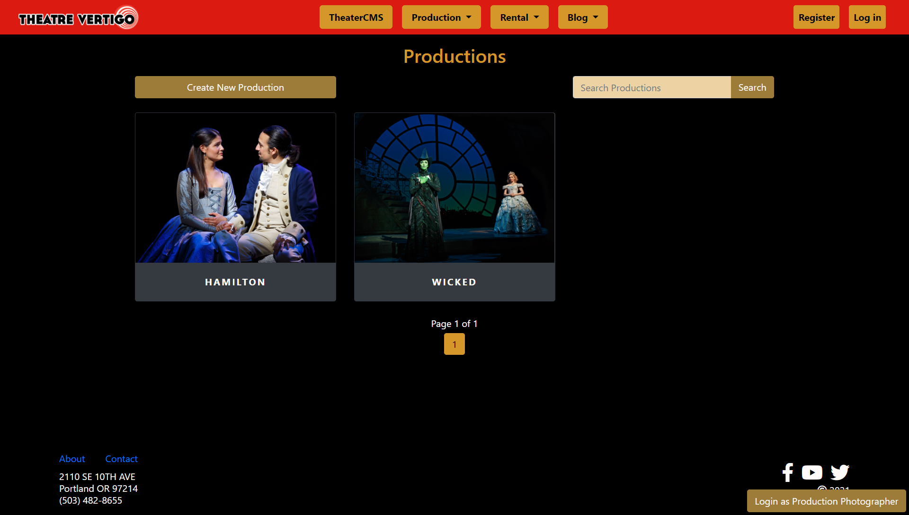
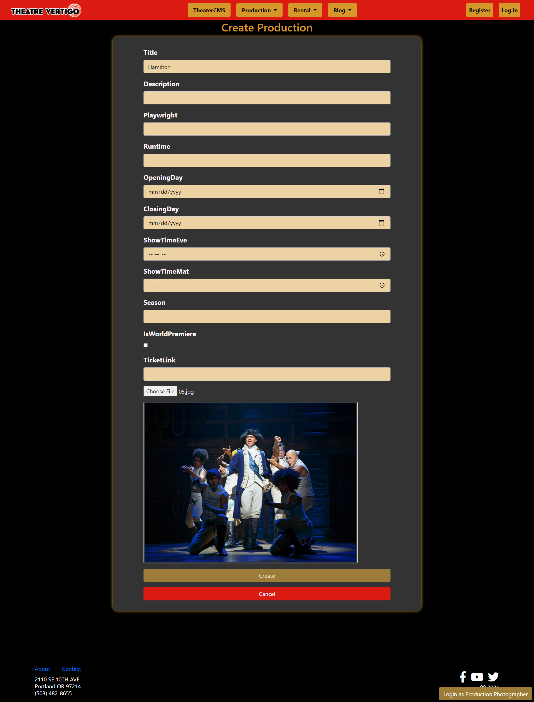
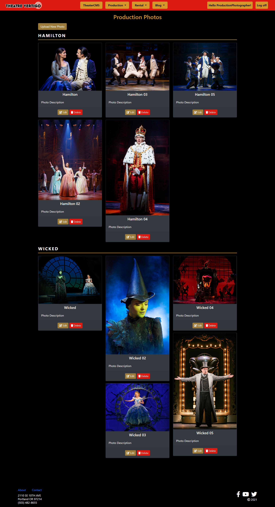

# Theater Vertigo CMS Project
Aug - Sept. 2021
## Introduction
The Theater Vertigo CMS Project was a two week sprint where my team was tasked with building out a section of a new website for a theater in Portland. We were assigned to a specific portion of the website and tasked to build CRUD functionality, set up permissions and roles, and style the front end. 

Over the two week period we utilized Agile/Scrum methodologies for team and project management, git version control, and AzureDevOps as our PM medium. 
For this project I built out the Production and ProductionPhoto models. Both of these models had full CRUD functionality as well as some other features. I configured these models to have a One-To-Many relationship in the database, since each ProductionPhoto has an associated Production it's linked to. After building both models I seeded some productions with photos to the database.

---
## Production Model
I created the Production model for the website which keeps track of all the productions the theatre puts on.  I implemented basic CRUD functionality and then styled every page to fit with the chosen theme for the website.  The index page uses boostrap cards to display the productions and has a search bar with pagination.

*Index page for Production Model with search and pagination*

Each Production requires a Default Photo, so the user is also required to upload a new Production Photo when creating a Production.  Productions and Production Photos are configured with a One-To-Many relationship and the uploaded photo is set as the Production's "Default Photo" when it's created.

*Creating productions along with a new default Production Photo with preview*

---
## ProductionPhoto Model
I also created the model for keeping track of Production Photos.  The user can upload a photo which is then converted to a `byte[]` and saved to the database.

*Index page for Production Photos using bootstrap cards. The Upload, Edit, and Delete buttons are only visible while logged in as a Production Photographer.*

